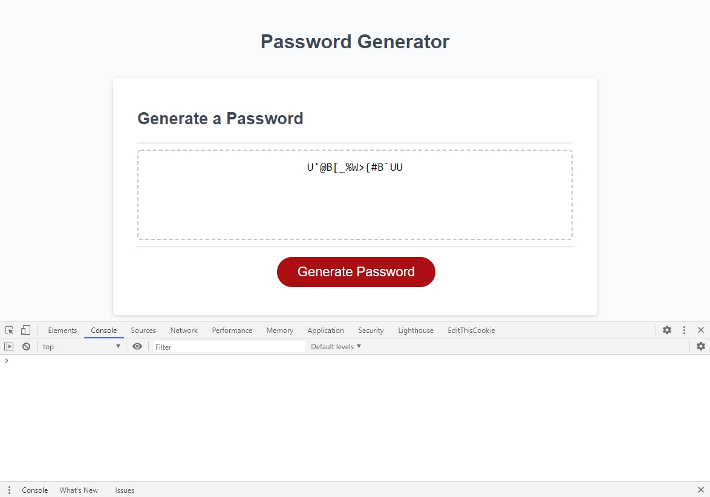

# Password Generation in Javascript
## Table of Contents
- [Summary](#summary)
- [Javascript Changes](#javascript-changes)
- [Deployed Application](#deployed-application)
- [Screenshot](#screenshot)

## Summary
In this project, existing code was provided as a skeleton to generate a password.  The final code had to:
1. Ask the user for a password length of 8 to 128, inclusive
2. Ask the user what character types had to be in the password: lowercase, uppercase, numbers, and/or symbols
3. Verify the password length was valid and at least one character type was chosen
4. Produced a password that matched all the selected criteria and displayed it to the user

## Javascript Changes
- Added global variables 
  - Each set of character types
  - Minimum and maximum password length
- Password requirements gathering
  - Used an object to track the user's requirements on password length and required character types
  - Gathered, validated, and sanitized requirements from the user
  - Required the user to re-enter data if it was not valid
- Created a password based on the requested length and required character types
  - Used two-dimensional array to collect valid character types
  - Used random number generator to pick character type and item from that character type
  - Built string from randomly selected characters
- Checked that all required character types were used
  - Wrote an algorithm to determine if the password generation was nearly finished
  - If all required character types were not used by that point, the missing ones were used
- Refactored folder structure
  - Moved all code from Develop folder to root folder
  - Organized assets into their own folders

## Deployed Application
- The web page can be found at [https://jesseparent.github.io/password-generator/](https://jesseparent.github.io/password-generator/)

## Screenshot
- The screenshot of the final work (note the absence of errors in the console): 